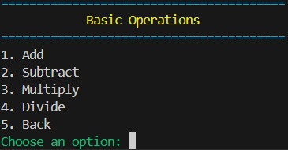
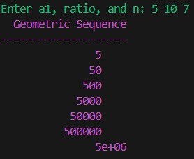

# PyCalc Pro v1.1.1

A feature-rich **command-line calculator** written in Python — supports **advanced math**, **sequences**, and **number theory** with a modular menu system and colorful terminal interface.

---

## Version Notes
v1.1.1 — October 2025

* Project Structure Update: Moved community files to .github/ folder for cleaner organization
* Packaging Ready: Added pyproject.toml for modern Python distribution
* Cleaner CLI with responsive progress bars
* License Update: Modified MIT license terms
* No Functional Changes: Calculator performance and features identical to v1.1.0

---

### Advanced Calculator Menus

| Basic Operations | Advanced Math |
| :---: | :---: |
|  |  |

| Sequences & Number Theory | Example Output |
| :---: | :---: |
|  |  |

---

## Features

* Basic arithmetic operations (add, subtract, multiply, divide)
* Advanced math (power, square roots, trigonometry, logarithms)
* Sequences and number theory functions
* Modular menu-driven CLI interface
* Color-coded output using colorama
* Formatted tables using tabulate

---

## Installation & Usage

### Option 1: Install from GitHub (Recommended)
```bash
pip install git+https://github.com/lw-xiong/pycalc-pro.git
pycalc
```
### Option 2: Clone and Run
```bash
git clone https://github.com/lw-xiong/pycalc-pro.git
cd pycalc-pro
pip install -r requirements.txt
python calculator.py
```

---

## Author
Li Wen Xiong (李文雄)
GitHub: @lw-xiong

---

## License

This project is licensed under the MIT License — you’re free to use, modify, and share it with credit.

---

PyCalc Pro — Smart. Fast. Powerful.
