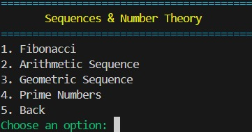

# PyCalc Pro v2.0.0

A feature-rich **command-line calculator** written in Python — supports **advanced math**, **sequences**, and **number theory** with a modular menu system and colorful terminal interface.

---

## Version Notes
v2.0.0 — October 2025

* Major optimization pass with caching and NumPy integration
* Improved Fibonacci and prime generation performance (up to 16× faster)
* Cleaner CLI with responsive progress bars
* Reduced clutter, safer large-number handling
* Enhanced modular structure for future extensions

---

### Advanced Calculator Menus

| Basic Operations | Advanced Math |
| :---: | :---: |
|  |  |

| Sequences & Number Theory | Example Output |
| :---: | :---: |
|  |  |

---

## Features

* Basic arithmetic operations (add, subtract, multiply, divide)
* Advanced math (power, square roots, trigonometry, logarithms)
* Sequences and number theory functions
* Modular menu-driven CLI interface
* Color-coded output using colorama
* Formatted tables using tabulate

---

## Installation & Usage

To get started with PyCalc Pro, clone the repository, install the dependencies, and run the main script. All the commands you need are in this single, convenient block:

```bash
git clone https://github.com/lw-xiong/pycalc-pro.git
cd pycalc-pro
pip install -r requirements.txt
python calculator.py
```
---

## Author
Li Wen Xiong (李文雄)
GitHub: @lw-xiong

---

## License

This project is licensed under the MIT License — you’re free to use, modify, and share it with credit.

---

PyCalc Pro — Smart. Fast. Powerful.
